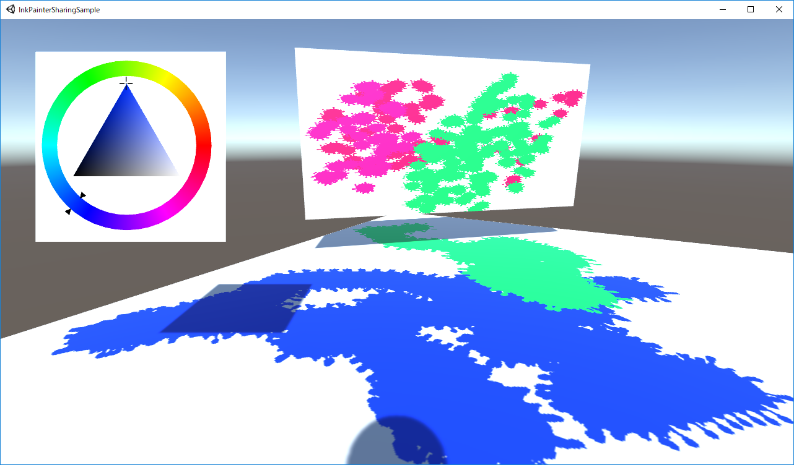
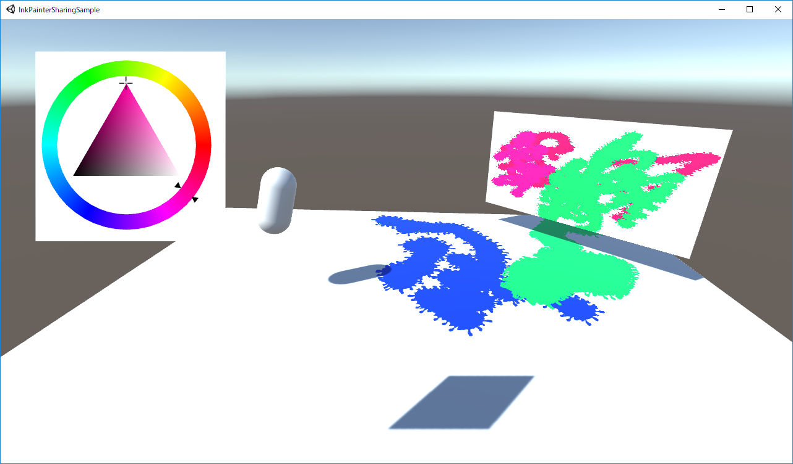

# InkPainter Sharing Sample

[Watch on Youtube](https://youtu.be/vqR_EMFM9tw)

## Tested Environment
- Unity 2018.3.7f1
- Windows 10 Pro

## Third party assets
You need to import the following assets from Unity Asset Store.

- [PUN 2 (v2.9)](https://assetstore.unity.com/packages/tools/network/pun-2-free-119922)

- [Color Picker Triangle](https://assetstore.unity.com/packages/tools/gui/color-picker-triangle-91518)

The following assets are included in this project.

- [InkPainter](https://github.com/EsProgram/InkPainter)  
Licensed under the MIT License. Copyright (c) Es_Program.  
